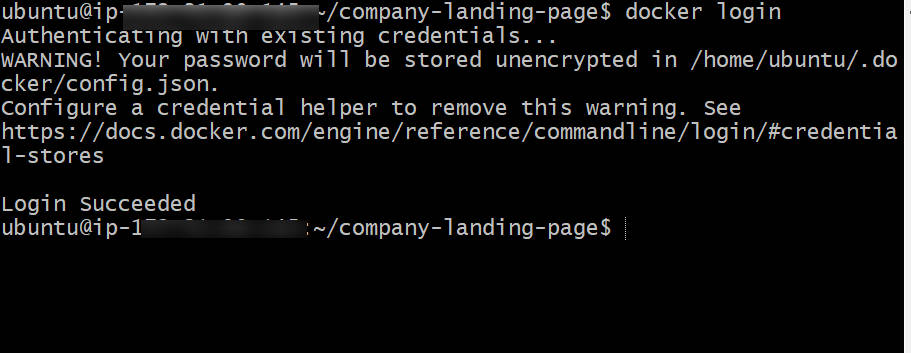
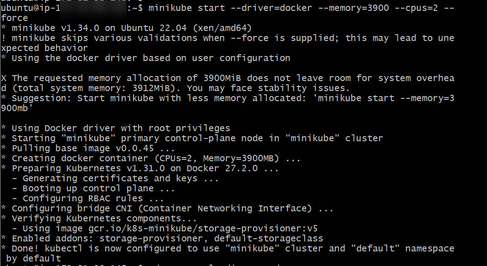

# **Basic Frontend Application with Docker and Kubernetes** #

## 1. **Hypothetical Use Case** ##

You are developing a simple static website (HTML and CSS) for a company's landing page. The goal is to containerize this application using Docker, deploy it to a Kubernetes cluster, and access it through Nginx.

## **2. Tasks** ##
### **Task 1: Set up your project** ###
* Create a new project directory.
* Inside the directory, create an HTML file (`index.html`) and a CSS file (`styles.css`).

Create a folder/directory for your project and `cd`  into the directory to create our (`index.html) and (`styles.css`) files.

### **Task 2: Initialize Git** ###
* Initialize a Git repository in your project directory.

### **Task 3: Git Commit** ###
* Add and commit your initial code to the Git repository.

    

    Still in directory where we created our  index.html and styles.css files, so then we initialize Git inside the directory, and add our files to staging and then commit the changes.

### **Task 4: Dockerize the application** ###
* Create a 'Dockerfile specifying Nginx as the base image.

Docker created as shown above.

    
    Using Nano text editor to write the commands for specifying Nginx as the base image.

 * Copy your HTML and CSS files into the Nginx HTML directory. Use ChatGPT to generate a basic HTML and CSS code for a simple web application).
 
 Index.html file.

    
    Styles.css file.

### **Task 5: Push to Docker Hub** ###
* Log in to Docker Hub.

Using `docker login` command , as default you will asked to input your Docker Hub user id/username and then your password to log in from your terminal. My account has been logged in from the terminal before, that's why It's didn't request for my credentials in the image above.

    Before pushing to your Docker Hub account, you will need to create a running container and docker image.
    

    

     

    This shows our running container, checking it with `docker ps` as seen above.

* Push your Docker image to Docker Hub.

    To push the image, it needs to have a valid Docker Hub repository tag in the format:(your-dockerhub-username)/(repository-name):(tag).
    For example, my Docker Hub username is sonofabdulkareem,  the command is:

    
     Tagged Image for Docker Hub

    
    Docker image pushed. 

    
    Confirmatiion that the image is listed under my repository.

### **Task 6: Set  up a Kind Kubernetes Cluster** ###
* Install Kind (Kubernetes in docker).
In this case, I used minikube (kubernetes in docker) instead of kind (kubernetes in docker),because installing Kind Kubernetes makes my system start malfunctioning and almost hard to operate on. Besides, I've had minikube and kubectl installed already.
All i just did was to start my mnikube. It actually comes with a Kubernetes Cluster as default.

    

### **Track 7: Deploy to Kubernetes** ###
* Create a Kubernetes Deplovment YAML file specifvina the image and desired replicas.

    
    Created a  Deployment.yaml file with a specified content.

* Apply the deployment to your cluster.

    
    The contents of the image above also shows our deployments running in our pod list.

### **Task 8: Create a Service (ClusterIP)** ###
* Create a Kubernetes Service YAML file specifying the type as ClusterIP.

    
    Created a  Service.yaml file with a specified content.

* Apply the service to your cluster.

    

### **Task 9: Access the Application** ###
* Port-forward to the service to access the application locally.

    
    This forwards port 8080 on your machine to port 80 inside the service.

* Open your browser and visit the specified port to view your simple frontend application.

    
    You should see your  page with the Nginx container serving the HTML and CSS content like this.

